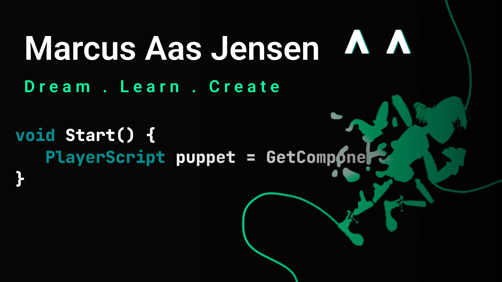

  

<!--# GitHub stats 📈 -->

  

  

  

  

  

<h1>Hi I'm Marcus </h1>   

>*Creativity - Curiosity - Competency*

I am Marcus Aas Jensen, a french student at [Polytech](https://polytech.univ-cotedazur.fr/) and an inspired creator striving to become a software engineer. 💻

I am greatly interested in video game development, rendering, quantum computing and in building creative tools for artists wishing for better solutions to express themselves. 🖌️🕹️ 

As an artist myself, I love to create video games with the Unity Engine to tell stories and to improve my programming skills as well. 🌱

---

# Languages selection ⌨️

<table align="center">
  <td></td>
  <td></td>
  <td></td>
  <td></td>
  <td></td>
</table>

# Main tools 🛠️
<table align="center">
  <td> Unity</td>
  <td> VS</td>
  <td> VS Code</td>
  <td> JetBrains</td>
  <td> Git</td>
    <td> Github</td>
  <td> Notion</td>
  <td> Figma</td>
</table>

 

# Operating systems 💻
<table align="center">
  <td> Windows 11</td>
  <td> Ubuntu</td>
    <td> Android</td>
</table>

 

---

# Wanna connect? 👻

*Follow me here*👍

  
  
  
  

**psssst! Would you mind sharing that link?**

  <a href="https://linktr.ee/marcus_a">

  
*Thanks again* 😉

 

