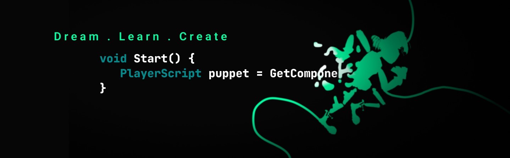

# Marcus Aas Jensen 
@marcusaasjensen

*Creativity - Curiosity - Competency*

I am Marcus Aas Jensen, an inspired creator striving to become a software engineer 💻. I am greatly interested in video game development 🕹️ and in building tools for artists wishing for better solutions when using creative tools 🖌️🎨. As an artist myself, I love to create video games with the Unity Engine to tell stories and to improve my programming skills as well 🌱.

## My links

 

**Share my content 😉**

  <a href="https://linktr.ee/marcus_a">

---

  

  

### Programming languages

  
  
  
  

 

### My main tools

  
  
  
  
  

 

#

